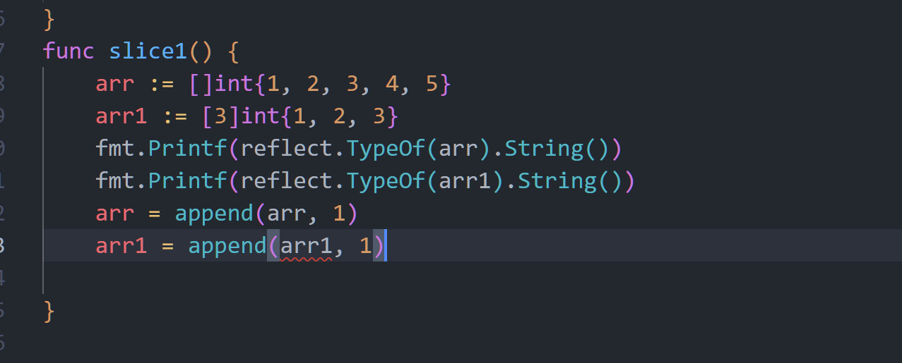

# some concept about code

memo it that the go invented by master who designed C++, some minds is like C Plus Plus

such as Pointer,Address,

there is a saying that simple is suitable for Go,Therefore ,We call it as Go，not Golang

# arry and slice

there is erro that arr1 can not append method

this is why arr1's type is not slice ,but arry `[3]int`.
it's length is fixed.

Otherwise, value arr can add elements, its type is `[]int`

this scene show when init a var , slice has difference with arr